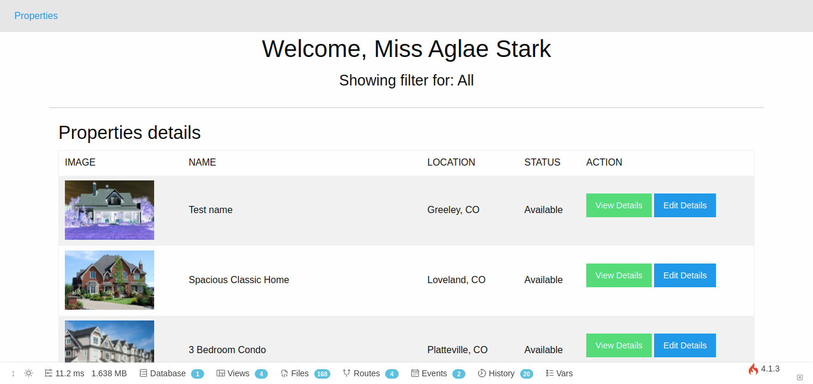

<p align="center">
  <a href="https://github.com/KipchirchirIan/">
    
  </a>
</p>


  <h3 align="center">Learning CodeIgniter 3 - LinkedIn Learning</h3>

  <p align="center">
    This is the final product of the course <a href="https://www.linkedin.com/learning/learning-codeigniter-3">Learning CodeIgniter 3 by Bernardo Pineda</a> done using CodeIgniter 4.
  </p>

<details open="open">
  <summary><h2 style="display: inline-block">Table of Contents</h2></summary>
  <ol>
    <li>
      <a href="#about-the-project">About The Project</a>
      <ul>
        <li><a href="#built-with">Built With</a></li>
      </ul>
    </li>
    <li>
      <a href="#getting-started">Getting Started</a>
      <ul>
        <li><a href="#prerequisites">Prerequisites</a></li>
        <li><a href="#installation">Installation</a></li>
      </ul>
    </li>
    <li><a href="#license">License</a></li>
    <li><a href="#contact">Contact</a></li>
    <li><a href="#acknowledgements">Acknowledgements</a></li>
  </ol>
</details>


## About The Project



### Built With

* [CodeIgniter 4](https://www.codeigniter.com/)

## Getting Started

To get a local copy up and running follow these simple steps.

### Prerequisites

* Composer - See [Composer](https://getcomposer.org/) on how to install it.
* PHP 7.3+
* Apache
* MySQL
* For more requirements - see [CodeIgniter 4 server requirements](https://codeigniter.com/user_guide/intro/requirements.html)

### Installation

1. Clone the repo
   ```sh
   git clone https://github.com/KipchirchirIan/codeigniter4_linkedinlearning.git
   ```
   
2. Switch to the projects directory
   
   ```sh
   cd ./your_project
   ```
   
3. Install Composer packages

   ```sh
   composer install
   ```

4. Import the database with your favorite database administration tool. See file `ci_course.sql` located at the root of the project folder.

5. Create a copy of `env` file and rename it to `.env`.

6. Change contents of `.env` to as follows:

   ```
   #--------------------------------------------------------------------
   # ENVIRONMENT
   #--------------------------------------------------------------------
   CI_ENVIRONMENT = development
   #--------------------------------------------------------------------
   # APP
   #--------------------------------------------------------------------
   # If you run project using spark, it will automatically try to serve
   # using http://localhost:8080, otherwise enter the appropriate base url.
   app.baseURL = 'http://localhost:8080/'
   #--------------------------------------------------------------------
   # DATABASE
   #--------------------------------------------------------------------
   database.default.hostname = 127.0.0.1
   database.default.database = ci_course
   database.default.username = your_username
   database.default.password = your_password
   database.default.DBDriver = MySQLi
   ```

7. Run

   ```sh
   php spark serve
   ```

### *Note*

I tried to keep it as simple as possible and followed along with the course. Therefore, I did not make use of things like migrations e.t.c and I did not write any tests. 

## License

Distributed under the MIT License. See `LICENSE` for more information.

## Contact

- Twitter - [@ian_codes](https://twitter.com/ian_codes) 
- Instagram - [@ian_codes](https://instagram.com/ian_codes)
- LinkedIn - [Ian Kipchirchir](https://ke.linkedin.com/in/kipchirchirian)
- Mail - [Send me an email](potterke4@gmail.com)

## Acknowledgements

* [LinkedIn Learning](https://www.linkedin.com/learning/)
* [CodeIgniter](https://codeigniter.com)
* [Bernardo Pineda](https://www.linkedin.com/learning/instructors/bernardo-pineda)


